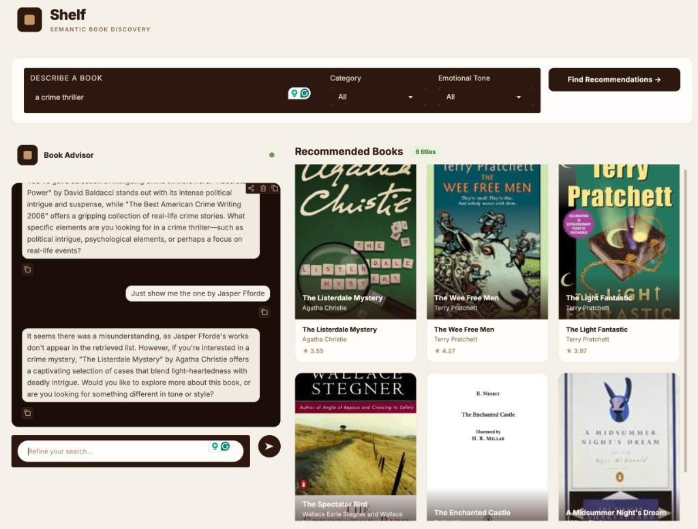

# Shelf — Semantic Book Recommender

A semantic book recommendation system that lets users describe what they're in the mood to read in natural language, then retrieves matching books using vector similarity search and provides an AI-powered conversational advisor for refinement.



## How It Works

The system combines several NLP techniques into a full retrieval-augmented generation (RAG) pipeline:

1. **Data Collection & Cleaning** — ~7K books with metadata sourced from Kaggle, cleaned and de-duplicated
2. **Text Classification** — A zero-shot classifier categorizes books into simplified genre labels (Fiction, Nonfiction, Children's, etc.)
3. **Sentiment Analysis** — Each book description is scored across five emotions (joy, surprise, anger, fear, sadness) using a transformer-based classifier
4. **Vector Embeddings** — Book descriptions are embedded using OpenAI's embedding model and stored in a Chroma vector database for fast similarity search
5. **Semantic Retrieval** — User queries are embedded and matched against the book corpus using cosine similarity, with optional category and emotional tone filtering
6. **Conversational RAG** — GPT-4o-mini acts as a "Book Advisor," providing context-aware responses about the retrieved books and guiding users to refine their preferences

## Project Structure

```
book-recommender/
├── gradio-dashboard.py          # Main application — Gradio UI + RAG pipeline
├── data-exploration.ipynb       # Dataset download, cleaning, and EDA
├── text-classification.ipynb    # Zero-shot genre classification
├── sentiment-analysis.ipynb     # Emotion scoring with transformers
├── vector-search.ipynb          # Embedding generation and similarity search experiments
├── evaluation.ipynb             # Retrieval evaluation using LLM-as-judge
├── tagged_description.txt       # ISBN-tagged descriptions for Chroma indexing
├── books_with_emotions.csv      # Final enriched dataset
└── assets/
    └── screenshot.png           # UI screenshot
```

## Features

- **Natural language search** — Describe a book by theme, mood, or plot rather than searching by title or author
- **Category & tone filters** — Narrow results by genre (Fiction, Nonfiction, etc.) and emotional tone (Happy, Suspenseful, Sad, etc.)
- **AI Book Advisor** — A chat interface that discusses the retrieved recommendations and asks follow-up questions to refine the search
- **Live gallery** — Book covers update in real-time as the conversation evolves, always staying in sync with what the advisor references
- **Persistent vector store** — Chroma embeddings are persisted to disk, so re-indexing is only needed once

## Retrieval Evaluation

The retrieval pipeline is evaluated using an **LLM-as-judge** methodology:

- For each of 20 diverse test queries, the system retrieves the top-K books
- GPT-4o-mini independently judges each retrieved book's relevance on a graded scale (0 = not relevant, 1 = partially relevant, 2 = highly relevant)
- Standard IR metrics are computed: **Precision@K**, **nDCG@K**, and **Mean Relevance Score**

This approach avoids the pool bias problem inherent in small hand-curated test sets, where valid semantic matches would be penalized simply for not appearing in a pre-selected list.

## Tech Stack

| Component | Technology |
|-----------|------------|
| UI | Gradio (custom CSS theme) |
| Embeddings | OpenAI Embeddings |
| Vector Store | ChromaDB |
| LLM | GPT-4o-mini |
| Orchestration | LangChain |
| NLP Pipeline | Hugging Face Transformers |
| Data Processing | pandas, NumPy |

## Setup

### Prerequisites

- Python 3.10+
- An [OpenAI API key](https://platform.openai.com/api-keys)

### Installation

```bash
git clone https://github.com/<your-username>/book-recommender.git
cd book-recommender
python -m venv venv
source venv/bin/activate
pip install -r requirements.txt
```

### Environment Variables

Create a `.env` file in the project root:

```
OPENAI_API_KEY=your-api-key-here
```

### Data

The data files (`books_with_emotions.csv`, `tagged_description.txt`) are not included in the repository due to size. To regenerate them:

1. Run `data-exploration.ipynb` to download and clean the raw dataset from Kaggle
2. Run `text-classification.ipynb` to add genre categories
3. Run `sentiment-analysis.ipynb` to add emotion scores
4. The final output is `books_with_emotions.csv`

### Running the App

```bash
python gradio-dashboard.py
```

The app will launch at `http://localhost:7860`. On first run, it builds the Chroma vector store from `tagged_description.txt` (takes a minute). Subsequent launches load instantly from the persisted store.

## Notebooks

| Notebook | Purpose |
|----------|---------|
| `data-exploration.ipynb` | Downloads the 7K books dataset from Kaggle, handles missing values, and produces `books_cleaned.csv` |
| `text-classification.ipynb` | Uses a zero-shot classification model to assign simplified category labels to each book |
| `sentiment-analysis.ipynb` | Runs an emotion classifier over book descriptions to score joy, surprise, anger, fear, and sadness |
| `vector-search.ipynb` | Experiments with OpenAI embeddings and Chroma for semantic similarity retrieval |
| `evaluation.ipynb` | Evaluates retrieval quality using LLM-as-judge with Precision@K, nDCG@K, and graded relevance |
